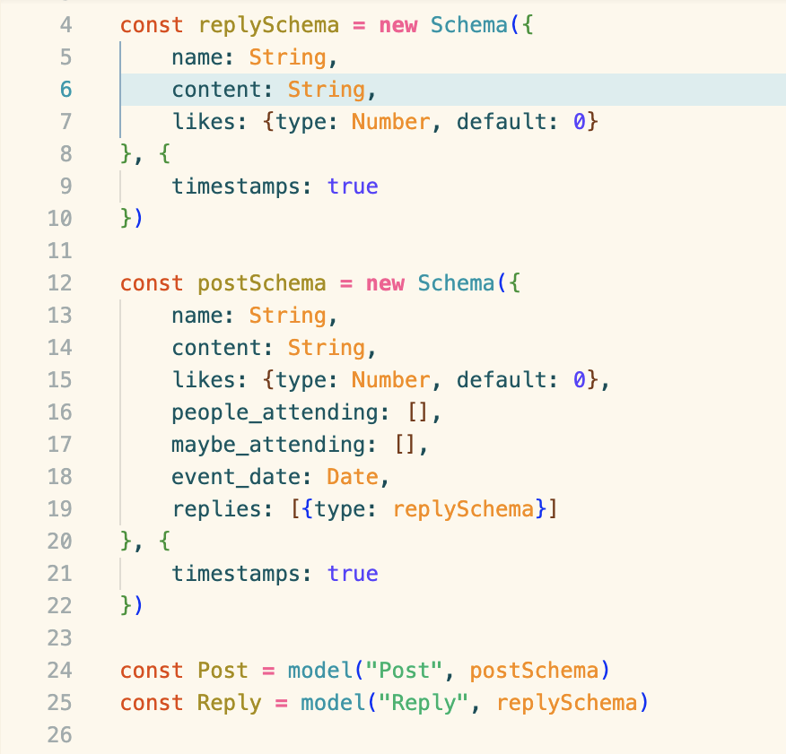

<h1><strong>Huddle and Chill</strong></h1>

Huddle and Chill is a twitter like app where users can post events that they're coordinating and share drop pins and event times so people can meet up and chill while playing sports. I created the app for me and my friends to be able to have enough people to play sports like Volleyball and Badminton outside of the available time frame of our friends schedules. 

<h1><strong>Technologies Used</strong></h1>

The app is created with the MERN infrastructure which comprises of Mongoose, Express, React, and Node.js. I am also using the Google OAuth React Login library.

<h1><strong>User Experience</strong></h1>

For my app, I wanted the user to be able to log in with Google OAuth or normal login. After logging in, a twitter like post feed shows up. Users are able to post events with set locations and times. Posts will have a like, attending, and maybe attending functionality where each user can click and show if they're attending. If they're not attending, they just don't need to interact with the post. 

The app should take the user's location and search for nearby events. Users upload their own profile image and reply to other people's posts while having admin settings over their own.

<h1><strong>ERD</strong></h1>

<h1><strong>Wireframe</strong></h1>

<h1><strong>Future Goals</strong></h1>

For my future goals, I want to add Google Maps and add functionality to my posts where I can pin locations and add event times. Once event times pass, they're deleted after a day or archived. I want to implement a search by location feature, and instant messaging using firebase between users.

